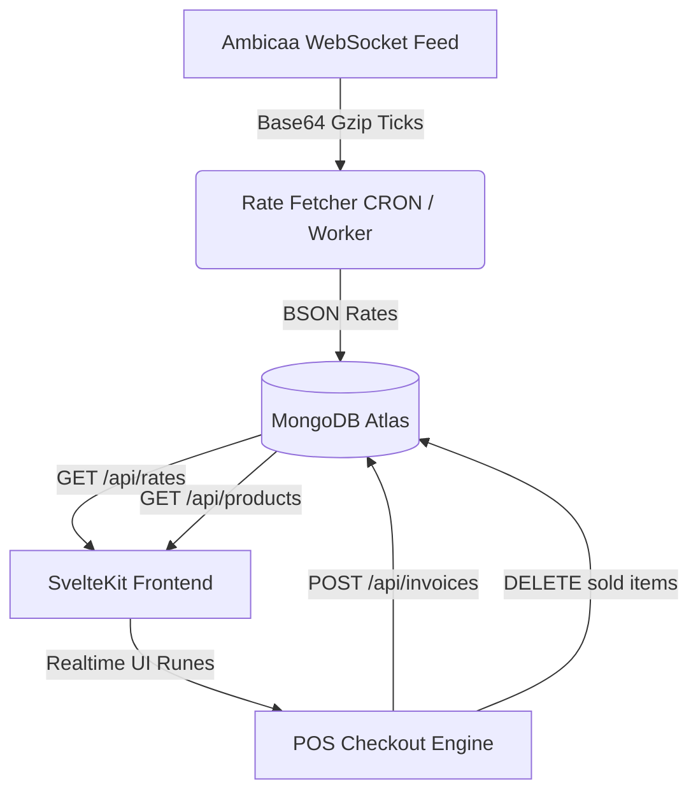

# Sunrise Fine Jewells — Live Bullion & POS Inventory Management Dashboard

[](https://kit.svelte.dev/)
[](https://www.mongodb.com/)
[](https://nodejs.org/)
[](LICENSE)

An enterprise-grade, internal management portal and Point-of-Sale (POS) system designed for **Sunrise Fine Jewells**. This application connects directly to a live bullion WebSocket feed to calculate dynamic, real-time market valuations for gold and silver stock. The portal includes advanced inventory management, a walk-in pricing calculator, a barcode generator, webcam-based scanning capabilities, and a unified sales/resale transaction engine.

---

## 📖 Table of Contents
1. [Project Overview](#project-overview)
2. [Features](#features)
3. [System Architecture](#system-architecture)
4. [Prerequisites](#prerequisites)
5. [Installation & Setup](#installation-setup)
6. [Configuration](#configuration)
7. [Project Structure](#project-structure)
8. [API Specifications](#api-specifications)
9. [Core Business Logic & Valuation Formulas](#core-business-logic--valuation-formulas)
10. [Usage Guide](#usage-guide)
11. [Troubleshooting](#troubleshooting)
12. [Contributing](#contributing)
13. [License](#license)

---

## 🔍 Project Overview

Sunrise Fine Jewells requires an agile internal tool that updates item pricing dynamically based on live market spot rates for gold and silver. Staff at the store counter can enter stock with specific properties (weight, making charges, purity), and the system handles the continuous recalculation of the store's inventory valuation.

The system features:
* **Live Price Discovery:** WebSocket feed integration with regional bullion feeds for 24K, 22K, 18K gold, and silver.
* **Point of Sale (POS):** A unified cart that supports both client sales and client resales (exchanges).
* **Jewellery Labeling:** Automatic generation of unique Code 39 barcodes and printable jewellery tags.
* **Webcam Scanning:** Direct hardware integration using `html5-qrcode` to scan item tags at checkout.

---

## ⚡ Features

### 📈 Live Bullion Feed & Manual Overrides
* **Real-time Synchronization:** Subscribes to the live Ambicaa bullion feed. In case of connection drops, it gracefully falls back to the last recorded rates in the database.
* **Purity Scaling:** Auto-calculates pricing parameters for 24K, 22K, and 18K gold.
* **Merchant Rate Overrides:** Store owners can toggle off live feeds to freeze rates manually to a locked per-gram value for store-wide counter negotiations.

### 💍 Advanced Inventory Control & Stock Entry
* **Dynamic Catalog:** Live list of available jewelry sorted by valuation, category, weight, or date added.
* **Smart ID Generation:** Creates structured, non-duplicate barcode IDs (`GLD-[CATEGORY]-[YYYYMMDD]-[SEQ]`).
* **Tag Customization:** Generates printable jewellery tags (`600x300px` canvas layout) with the store name, generated barcode image, and item SKU.

### 🔄 Unified Cart & Resale (Exchange) Module
* **Sales Cart:** Select available items from inventory to sell.
* **Resale Cart:** Process client returns, scrap metal purchases, or buybacks. Accepts metal type, purity, weight, and flat deductions.
* **Dynamic Net Balance:** Instantly evaluates whether the customer has a Net Payable balance (to the store) or a Net Receivable balance (due from the store).
* **Smart Invoicing:** Automatically flags transactions as a **Tax Invoice** (for sales) or a **Purchase Voucher** (for buybacks/scrap purchases) based on net transaction structure.

---

## 🏗️ System Architecture

The project is built on **SvelteKit** using Svelte 5's reactive state system (Runes: `$state`, `$derived`, `$effect`) for instant UI updates.



### Database Schema Collections

* **`products`**: Stores current stock information (`status: "available"`).
* **`rates`**: Holds the latest rate document cached from the WebSocket server.
* **`invoice`**: Records complete transaction snapshots including sold items, received items, dates, and client information.

---

## 🛠️ Prerequisites

Before setting up the project, make sure you have the following installed:
* **Node.js** (v18.0.0 or higher)
* **npm** (v9.0.0 or higher)
* **MongoDB** (Local instance or MongoDB Atlas Connection URI)

---

## 🚀 Installation & Setup

1. **Clone the Repository:**
   ```bash
   git clone https://github.com/jonvikboi/okcredit-hackathon.git
   cd okcredit-hackathon
   ```

2. **Install Dependencies:**
   ```bash
   npm install
   ```

3. **Configure Environment Variables:**
   Create a `.env` file in the root directory (see [Configuration](#configuration)).

4. **Run Development Server:**
   ```bash
   npm run dev
   ```
   Open your browser and navigate to `http://localhost:5173`.

5. **Build for Production:**
   ```bash
   npm run build
   ```

---

## ⚙️ Configuration

Set up the following environment variables in your `.env` file:

```env
# MongoDB Connection Config
MONGODB_URI=mongodb+srv://<username>:<password>@cluster.mongodb.net/
DATABASE_NAME=okcredit_inventory

# Bullion Feed Settings
RATE_FEED_URL=ws://ambicaaspot.com:1001/bullion?user=ambicaa&auth=1&type=web

# Global POS Settings
GST_PERCENT=3
```

---

## 📁 Project Structure

```txt
okcredit-hackathon/
├── src/
│   ├── lib/
│   │   ├── assets/           # Default UI assets
│   │   ├── db.js             # MongoDB Atlas client initializer & credentials seeder
│   │   ├── mongoUri.js       # URI sanitization helper
│   │   ├── normalizeProduct.js # Normalization wrapper for database documents
│   │   └── rateFetcher.js    # SignalR/Gzip decoding and WebSocket handler
│   ├── routes/
│   │   ├── api/
│   │   │   ├── invoices/     # Endpoint to record sales/resales
│   │   │   ├── products/     # Endpoint to query/update inventory
│   │   │   └── rates/        # Bullion rate check endpoint
│   │   ├── +layout.svelte    # Global layout structure
│   │   └── +page.svelte      # Monolithic POS, Inventory, and Calculator Dashboard
└── package.json
```

---

## 🔌 API Specifications

### 📦 Products Endpoint

* **`GET /api/products`**
  Returns the active available product list from the catalog.
  * *Response Example (200 OK):*
    ```json
    {
      "success": true,
      "products": [
        {
          "id": "GLD-RNG294",
          "name": "22K Gold Ring",
          "purity": "22K",
          "weight": 5.4,
          "makingCharge": 0.12,
          "fixedValue": 0,
          "category": "Ring",
          "description": "Premium 22K gold ring added on 7/5/2026."
        }
      ]
    }
    ```

* **`POST /api/products`**
  Inserts a new product into the database.
  * *Payload Required:*
    ```json
    {
      "id": "GLD-RNG294",
      "name": "Premium 22K Gold Ring",
      "purity": "22K",
      "weight": 5.4,
      "makingCharge": 0.12,
      "fixedValue": 0,
      "category": "Ring",
      "description": "Hand-crafted 22K gold ring."
    }
    ```

* **`DELETE /api/products`**
  Deletes or archives sold items from the inventory.
  * *Payload Required:*
    ```json
    {
      "ids": ["GLD-RNG294"]
    }
    ```

---

### 📄 Invoices Endpoint

* **`POST /api/invoices`**
  Processes POS checkouts, capturing transaction snapshots.
  * *Payload Required:*
    ```json
    {
      "invoiceId": "SRF-384729",
      "date": "7/8/2026, 9:35:08 PM",
      "customerName": "Ramesh Gowda",
      "customerPhone": "9845012345",
      "items": [
        {
          "id": "GLD-RNG801",
          "name": "Premium 22K Gold Ring",
          "purity": "22K",
          "weight": 4.8,
          "ratePerGram": 7200,
          "totalPrice": 39715
        }
      ],
      "totalWeight": 4.8,
      "subtotal": 38558,
      "gst": 1157,
      "total": 39715,
      "resaleItems": [
        {
          "id": "RSL-991823",
          "name": "Old Gold Scrap",
          "purity": "22K",
          "weight": 5.5,
          "rate": 7100,
          "grossValue": 39050,
          "deduction": 550,
          "finalValue": 38500
        }
      ],
      "totalResaleWeight": 5.5,
      "totalResaleValue": 38500,
      "netPayable": 1215
    }
    ```

---

## 🧮 Core Business Logic & Valuation Formulas

The dynamic valuation of gold and silver jewelry is governed by these standardized formulas:

$$\text{Metal Value} = \text{Weight (g)} \times \text{Spot Rate per Gram}$$

$$\text{Making Charges} = \text{Metal Value} \times \text{Making Charge Fraction}$$

$$\text{Subtotal} = \text{Metal Value} + \text{Making Charges} + \text{Gemstone/Fixed Value}$$

$$\text{GST} = \text{Subtotal} \times 0.03$$

$$\text{Total Invoice Cost} = \text{Subtotal} + \text{GST}$$

For resale or scrap buybacks, the valuation uses direct calculations:

$$\text{Gross Resale Value} = \text{Resale Weight} \times \text{Purity Spot Rate}$$

$$\text{Final Resale Value} = \text{Gross Resale Value} - \text{Deductions}$$

$$\text{Net Payable/Receivable} = \text{Total Purchase Value} - \text{Total Resale Value}$$

---

## 📖 Usage Guide

### 1. Adding Stock to Inventory
1. Click the **Add Stock** tab.
2. Select your category (Ring, Necklace, etc.).
3. Choose the metal and purity (24K Gold, 22K Gold, 18K Gold, or Silver).
4. Enter the item's weight in grams.
5. Set the making charge (as a percentage, e.g. `12%`).
6. Press **Add to Stock**. The barcode will generate, and the item will appear in your catalog.

### 2. Barcode Scanning
1. Open the barcode scanner modal on the dashboard.
2. Grant camera permissions.
3. Position the jewellery tag in front of the camera. The item is automatically resolved in your catalog and can be added directly to the cart.

### 3. Exchanging / Buying Back Items (Resale)
1. Go to the **Resale/Exchange** tab.
2. Input the old metal type, purity, weight, and any flat deduction.
3. Click **Add to Resale Cart**.
4. Review the cart. The unified totals will calculate the net balance.
5. Complete checkout to render the appropriate **Tax Invoice** or **Purchase Voucher**.

---

## ⚠️ Troubleshooting

### 🔌 MongoDB Connection Timeouts
> [!IMPORTANT]
> If you deploy this project to Vercel and notice that the dashboard says *"No invoices found matching current filters"* or fails to load data, ensure that your MongoDB Atlas cluster allows connection requests from Vercel's serverless environment:
> 1. Go to **Network Access** in your MongoDB Atlas console.
> 2. Add an IP address rule: `0.0.0.0/0` (Allow Access From Anywhere). Vercel uses dynamic IPs, so restricting access to a single IP will block your cloud deployment.

### 📸 Webcam Scanner Not Launching
* Ensure your website is served over a secure connection (`https://`). Browsers block hardware access (like webcams) on unencrypted `http` connections.
* Go to site settings in your browser and verify that camera permissions are set to **Allow**.

### ⏰ Timezone Discrepancy on Invoices
* Vercel server runtimes are set to UTC by default. The date calculations in SvelteKit have been optimized using UTC methods (`setUTCHours`) to prevent date filters from misaligning by timezone offsets.

---

## 🤝 Contributing

Contributions are welcome! Please follow these guidelines:
1. Fork the project.
2. Create your feature branch (`git checkout -b feature/AmazingFeature`).
3. Commit your changes (`git commit -m 'Add some AmazingFeature'`).
4. Push to the branch (`git push origin feature/AmazingFeature`).
5. Open a Pull Request.

---

## 📄 License

Distributed under the MIT License. See [LICENSE](LICENSE) for more details.
